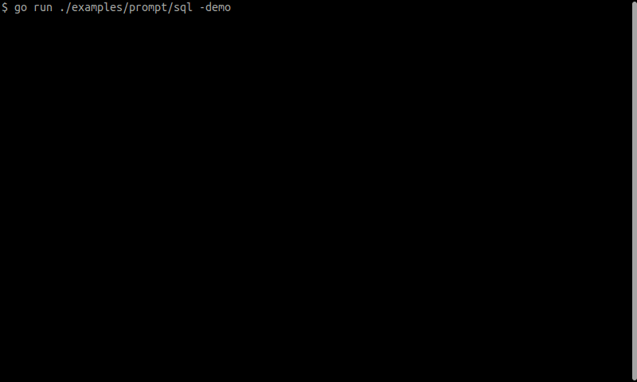

# go-prompter

Build full-featured CLI prompts in GoLang.

Demo of a SQL Prompt with the major features in play:

## Features

* Single-line and Multi-line prompt with line numbers
* [Syntax-Highlighting](prompt/syntax_highlighter.go) - use [Chroma](https://github.com/alecthomas/chroma) or roll-your-own
* Flexible [Auto-Complete](prompt/auto_completer.go) drop-downs
  * Start with built-in `AutoCompleter` for simple Keywords `SetAutoCompleter(...)`
  * Expand to context based additional Keywords using `SetAutoCompleterContextual(...)`
* Generate prompts with or without a "prefix"
* Header and Footer generator functions for dynamic content
* History integration with built-in go-back/go-forward/list/re-run
* Completely customizable [KeyMap](prompt/key_map.go)
  * Well-defined Actions that can be mapped to Key-Sequences
* Custom command-shortcuts for Key-Sequences
* Flexible [Styling/Customization](prompt/style.go) to change the look and feel of
  * Auto-Complete Drop-down
  * Cursor
  * Dimensions (height/width)
  * Line-Numbers
  * Scrollbar

## Bonus

* [Input](input) package that wraps around the [Bubble Tea](https://github.com/charmbracelet/bubbletea)
  library and provides a basic interface to capture input events
  * Key-presses
  * Mouse-clicks and motion
  * Window/terminal resizes
* [Powerline](powerline) package to generate Powerline-like lines
  * Supports "segments" on both left and right sides
  * Auto-adjust and auto-remove segments to meet terminal width limitations
  * Usable as header and/or prefix for the Prompt
