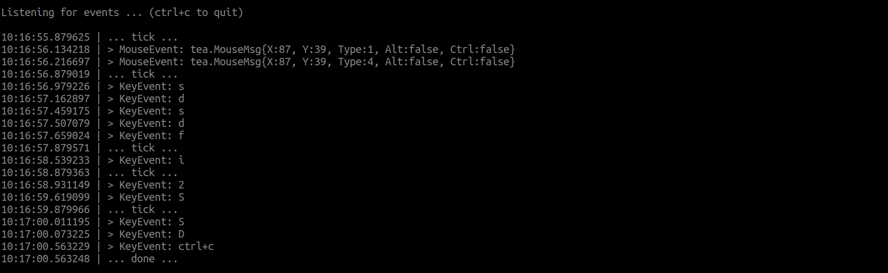

# input

Handle inputs from keyboard and mouse with ease. Wraps around the [Bubble Tea](github.com/charmbracelet/bubbletea)
library and provides a simpler interface to deal with the input:

* Key-presses
* Mouse-clicks and motion
* Window/terminal resizes

Example code can be found [here](/examples/input). Output:

