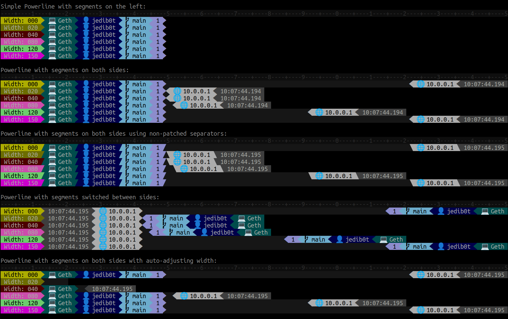

# powerline

Generate Powerline-like prompts in GoLang.

* Supports "segments" on both left and right sides
* Auto-adjust and auto-remove segments to meet terminal width limitations
* Usable as header and/or prefix for the Prompt

Example code can be found [here](/examples/powerline). Sample output:

